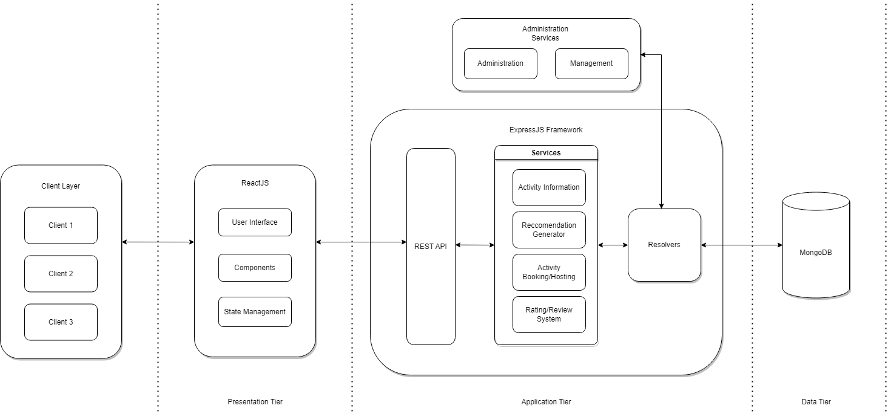

# ActiFind Server Files

## Common MERN Tasks

### Repository Creation
- [x] Backend
- [x] Frontend

[Frontend Repository](https://github.com/Asential/actiFind-frontend)

Technologies used

### Backend

- [x] Express Framework
- [x] MongoDB Atlas
- [x] REST API
- [x] Token Based Authentication

#### APIs
- [x] Login
- [x] Registration
- [x] JWT Token Authentication Middleware
- [x] Post Creation
- [x] Post Deletion
- [x] Edit Post 
- [x] Post Details 
- [x] Like Post
- [x] Search Functionalities with Tags

## Frontend 

- [x] React
- [X] Redux
- [x] Navigation Bar UI
- [x] Login UI
- [x] Registration UI
- [x] Search Bar UI
- [x] Post Cards UI
- [x] Home Page
- [x] Post Details Page
- [x] Google Authentication using OAuth2
- [x] Pagination 
- [x] Media Query Scaling

Current backend packages used.

- express
- mongoose
- nodemon
- cors
- jsonwebtoken
- bcryptjs
- materialui
- dotenv

Current frontend packages used.
- @material-ui/[core/icons/labs/]
- axios
- jwt-decode
- react-dom
- react-redux
- react-file-base64
- redux-thunk
- react=oauth/google

